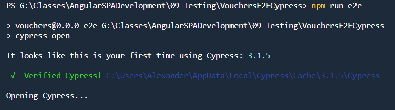
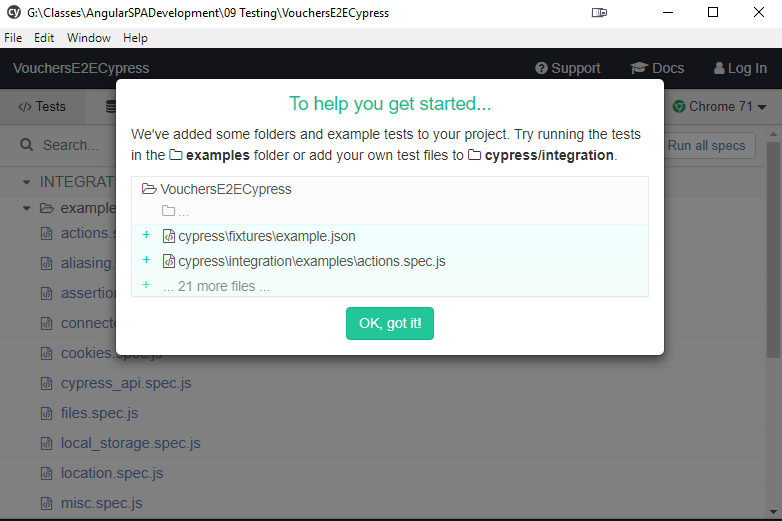

# Angular Testing

## Unit Testing

[Jasmine Matchers](https://jasmine.github.io/api/edge/matchers.html)

---

# Wallaby.js Unit Testing

[Wallaby VS Code Extension](https://marketplace.visualstudio.com/items?itemName=WallabyJs.wallaby-vscode)

## Setup

Install required packages

`npm i --save-dev electron@4.0.1 wallaby-webpack@3.9.10 angular2-template-loader`

Add `wallaby.js` to root folder:

```
wallabyWebpack = require("wallaby-webpack");
var path = require("path");

var compilerOptions = Object.assign(
  require("./tsconfig.json").compilerOptions,
  require("./src/tsconfig.spec.json").compilerOptions
);

compilerOptions.module = "CommonJs";

module.exports = function(wallaby) {
  var webpackPostprocessor = wallabyWebpack({
    entryPatterns: ["src/wallabyTest.js", "src/**/*spec.js"],

    module: {
      rules: [
        { test: /\.css$/, loader: ["raw-loader"] },
        { test: /\.html$/, loader: "raw-loader" },
        {
          test: /\.ts$/,
          loader: "@ngtools/webpack",
          include: /node_modules/,
          query: { tsConfigPath: "tsconfig.json" }
        },
        {
          test: /\.js$/,
          loader: "angular2-template-loader",
          exclude: /node_modules/
        },
        { test: /\.styl$/, loaders: ["raw-loader", "stylus-loader"] },
        {
          test: /\.less$/,
          loaders: [
            "raw-loader",
            { loader: "less-loader", options: { paths: [__dirname] } }
          ]
        },
        { test: /\.scss$|\.sass$/, loaders: ["raw-loader", "sass-loader"] },
        { test: /\.(jpg|png|svg)$/, loader: "url-loader?limit=128000" }
      ]
    },

    resolve: {
      extensions: [".js", ".ts"],
      modules: [
        path.join(wallaby.projectCacheDir, "src/app"),
        path.join(wallaby.projectCacheDir, "src"),
        "node_modules"
      ]
    },
    node: {
      fs: "empty",
      net: "empty",
      tls: "empty",
      dns: "empty"
    }
  });

  return {
    files: [
      {
        pattern: "src/**/*.+(ts|css|less|scss|sass|styl|html|json|svg)",
        load: false
      },
      { pattern: "src/**/*.d.ts", ignore: true },
      { pattern: "src/**/*spec.ts", ignore: true }
    ],

    tests: [
      { pattern: "src/**/*spec.ts", load: false },
      { pattern: "src/**/*e2e-spec.ts", ignore: true }
    ],

    testFramework: "jasmine",

    compilers: {
      "**/*.ts": wallaby.compilers.typeScript(compilerOptions)
    },

    middleware: function(app, express) {
      var path = require("path");
      app.use(
        "/favicon.ico",
        express.static(path.join(__dirname, "src/favicon.ico"))
      );
      app.use("/assets", express.static(path.join(__dirname, "src/assets")));
    },

    env: {
      kind: "electron"
    },

    postprocessor: webpackPostprocessor,

    setup: function() {
      window.__moduleBundler.loadTests();
    },

    debug: true
  };
};
```

Add `wallabyTest.ts` to src-folder

```
import './polyfills';

import 'zone.js/dist/zone-testing';

import { getTestBed } from '@angular/core/testing';
import {
  BrowserDynamicTestingModule,
  platformBrowserDynamicTesting
} from '@angular/platform-browser-dynamic/testing';

getTestBed().initTestEnvironment(
  BrowserDynamicTestingModule,
  platformBrowserDynamicTesting()
);
```

---

# Protractor

[Protractor Home](https://www.protractortest.org/)

[Locators Reference](https://www.protractortest.org/#/locators)

Navigate to `e2e/src/app.po.ts` & investigate code:

```
import { browser, by, element } from 'protractor';

export class AppPage {
  navigateTo() {
    return browser.get('/');
  }

  getParagraphText() {
    return element(by.css('app-root h1')).getText();
  }
}
```

Navigate to `e2e/src/app.e2e-spec.ts` & investigate spec:

```
import { AppPage } from "./app.po";

describe("workspace-project App", () => {
  let page: AppPage;

  beforeEach(() => {
    page = new AppPage();
  });

  it("should display welcome message", () => {
    page.navigateTo();
    expect(page.getParagraphText()).toEqual("Angular Testing");
  });
});
```

---

# Cypress E2E Testing

[Cypress Docs](https://docs.cypress.io/guides/overview/why-cypress.html#In-a-nutshell)

## Setup

Install packages: `npm i --save-dev cypress chance`

Modify `package.json` and run using `npm run e2e`

```
"scripts": {
    "ng": "ng",
    "start": "ng serve",
    "build": "ng build",
    "test": "ng test",
    "lint": "ng lint",
    "cypress": "cypress open"
  },
```

Examine sample tests in `/cypress/integration/examples`:

## Starting Cypress

Execute: `npm run e2e`

When running for the first time

- cypress is installed,
- a popup is shown
- the cypress folder in the project is created





## Write a Test

[Writing your first test](https://docs.cypress.io/guides/getting-started/writing-your-first-test.html)

- Start your App using `ng serve`

- Create a new file "vouchers.spec.js" in `/cypress/integration/`

- Add a reference to cypress to the top of the page

```
/// <reference types="Cypress" />
```

- Add the following structure to the file below the import

```
context('Demos', () => {
	beforeEach(() => {
		cy.visit('http://localhost:4200/demos');
	});

  //Add test here later
  
});
```


---

# .NET Core Testing in VS Code

[Automatic Unit Testing in .NET Core plus Code Coverage in Visual Studio Code](https://www.hanselman.com/blog/AutomaticUnitTestingInNETCorePlusCodeCoverageInVisualStudioCode.aspx)
